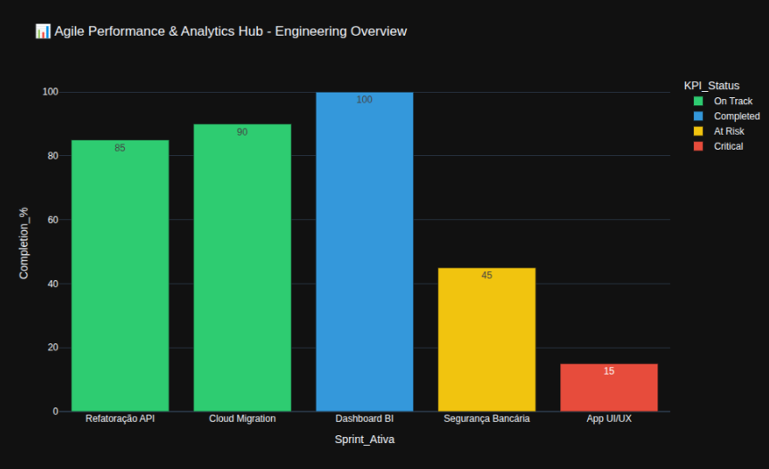

# 📊 Agile Performance & Analytics Hub (APAH)


## 📝 Descrição do Projeto
O **Agile Performance & Analytics Hub** é uma solução de Business Intelligence focada em gestão de projetos de software. O objetivo central é extrair dados de performance de Sprints e transformá-los em indicadores visuais (KPIs) para facilitar a governança e a tomada de decisão por gestores e stakeholders.

> **Status do Projeto:** 🟢 Produção / Finalizado

---

## 🎯 Objetivos de Negócio
1. **Transparência:** Fornecer uma visão clara do progresso das atividades.
2. **Previsibilidade:** Identificar gargalos (At Risk/Critical) antes que comprometam o cronograma.
3. **Eficiência:** Automação do relatório de status, eliminando preenchimento manual de planilhas.

---

## 🛠️ Stack Tecnológica
* **Linguagem:** [Python 3.12](https://www.python.org/)
* **Processamento de Dados:** [Pandas](https://pandas.pydata.org/)
* **Visualização:** [Plotly Express](https://plotly.com/python/)
* **Infraestrutura:** GitHub Pages para hospedagem estática.
* **CI/CD:** Automação de deploy via Git.

---

## 🏗️ Arquitetura e Organização
O projeto segue uma estrutura simplificada de pipeline de dados:
1. **Ingestão/Mock:** Os dados são simulados em estrutura de DataFrame (simulando um banco de dados).
2. **Processamento:** O script `analytics_engine.py` realiza a limpeza e cálculos de métricas.
3. **Output:** Geração do arquivo `index.html` contendo o dashboard interativo.
   
```text
/agile-performance-hub
├── 📄 analytics_engine.py  # Script principal (Lógica de Negócio)
├── 📄 index.html           # Dashboard renderizado (Front-end)
└── 📄 README.md            # Documentação técnica
